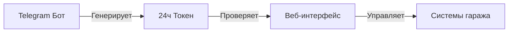
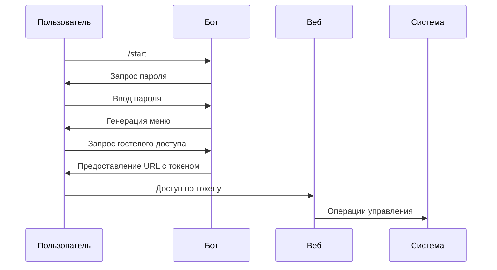

# Гараж

## Обзор
Система управления гаражом состоит из двух интерфейсов:
1. Интерфейс Telegram бота
2. Веб-интерфейс

Оба интерфейса обеспечивают доступ к управлению гаражом и функциям мониторинга с безопасной аутентификацией на основе токенов.

## Контроль доступа

### Telegram бот
- Первоначальный доступ требует аутентификации по паролю
- Пароль генерируется случайным образом и меняется после каждой успешной аутентификации
- Авторизованные пользователи могут генерировать гостевые токены, действительные в течение 24 часов

### Веб-интерфейс
- Доступ требует действительного токена, сгенерированного Telegram ботом
- Токены истекают через 24 часа
- Проверка токена происходит при каждом действии

## Функции

### Команды Telegram бота

#### Основные команды
- `/start` - Инициирует взаимодействие с ботом, требует пароль для первого доступа
- `/exit` - Выход текущего пользователя
- `/logs` - Загрузка журнала операций (только для авторизованных пользователей)

#### Кнопки главного меню
```
[Гость]
[Пароль] [Фото]
[Ворота Лево] [Ключница] [Ворота Право]
```

#### Функции кнопок
- **Гость** - Генерирует 24-часовой гостевой токен доступа с URL веб-интерфейса
- **Пароль** - Показывает текущий пароль аутентификации и прямую ссылку
- **Фото** - Отправляет текущий снимок с камеры гаража
- **Ворота Лево** - Управление левыми воротами (требуется проверка местоположения)
- **Ключница** - Управление ключницей (требуется проверка местоположения)
- **Ворота Право** - Управление правыми воротами (требуется проверка местоположения)

### Веб-интерфейс

#### Макет
```
[Трансляция с камеры]
[Счетчик оставшегося времени]
[Левые ворота] [Ключница] [Правые ворота]
```

#### Особенности
- Автоматическое обновление камеры (каждые 5 секунд)
- Счетчик обратного отсчета, показывающий срок действия токена
- Кнопки прямого управления воротами и ключницей
- Автоматическое обновление страницы при истечении срока действия токена

## Функции безопасности

### Проверка местоположения
- Требуется для физических операций управления в Telegram боте
- Максимально допустимое расстояние: 100 метров от гаража
- Проверка происходит перед каждой операцией управления

### Система токенов


### Процесс аутентификации


## Технические характеристики

### Схема базы данных
```sql
-- Таблица пользователей
users (
    id: Integer PRIMARY KEY,
    is_auth: Boolean,
    current_itern: String,
    created_at: DateTime
)

-- Системная конфигурация
system_config (
    id: Integer PRIMARY KEY,
    key: String UNIQUE,
    value: Text,
    updated_at: DateTime
)

-- Журнал операций
logs (
    id: Integer PRIMARY KEY,
    user: String,
    action: String,
    timestamp: Integer
)
```

### API Эндпоинты

#### Веб-интерфейс
```
GET /                 - Главный интерфейс
GET /photo           - Поток с камеры
GET /action          - Операции управления
GET /logs            - Журнал операций
```

### Формат логов
```
пользователь,действие,время
```
Пример:
```
web,left,1634567890
Иван,key_box,1634567891
```

## Обработка ошибок

### Основные состояния ошибок
- Недействительный токен
- Истекший токен
- Ошибка проверки местоположения
- Ошибка операции системы
- Ошибка сетевого взаимодействия

### Ответы об ошибках
```json
{
    "status": 403,
    "detail": "Токен истек"
}
```

## Ограничения и тайм-ауты
- Обновление камеры: 5 секунд
- Срок действия токена: 24 часа
- Проверка местоположения: радиус 100м
- Тайм-аут операции: 5 секунд

## CSS стили
```css
.button-30 {
    /* Стилизация премиум-кнопки */
    background-color: #FCFCFD;
    border-radius: 4px;
    box-shadow: rgba(45, 35, 66, 0.4) 0 2px 4px,
                rgba(45, 35, 66, 0.3) 0 7px 13px -3px,
                #D6D6E7 0 -3px 0 inset;
}

#photo {
    max-width: 60vw;
    max-height: 60vh;
}
```

## JavaScript функции

### Обновление времени
```javascript
function tick_time() {
    // Обновляет таймер обратного отсчета каждую секунду
}
```

### Обновление фото
```javascript
function tick_photo() {
    // Обновляет поток с камеры каждые 5 секунд
}
```

## Требования к установке

### Зависимости
```bash
pip install fastapi python-telegram-bot sqlalchemy cryptography aiohttp uvicorn jinja2
```

### Настройка окружения
```bash
export API_TOKEN="ваш_токен_telegram_бота"
export DATABASE_URL="sqlite:///garage.db"
```

## Обслуживание

### Регулярные задачи
- Резервное копирование базы данных
- Ротация логов
- Очистка токенов
- Мониторинг здоровья системы

### Точки мониторинга
- Скорость генерации токенов
- Процент успешных операций
- Время отклика системы
- Размер базы данных
- Скорость роста логов

## Рекомендации по безопасности

### Развертывание в продакшн
1. Использование HTTPS для всех веб-коммуникаций
2. Регулярная инвалидация токенов
3. Мониторинг доступа по IP
4. Мониторинг неудачных операций
5. Регулярные аудиты безопасности

### Конфигурация
1. Защита учетных данных базы данных
2. Защита API эндпоинтов
3. Реализация ограничения частоты запросов
4. Правильное логирование ошибок
5. Мониторинг контроля доступа

Эта документация предоставляет комплексный обзор функциональности системы управления гаражом, функций безопасности и технических характеристик.